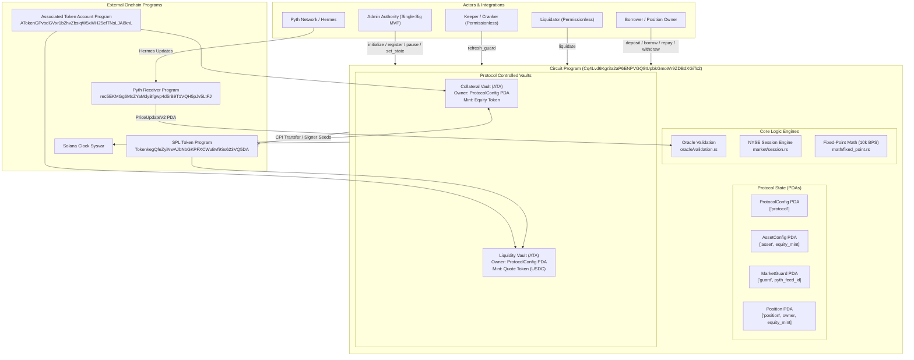
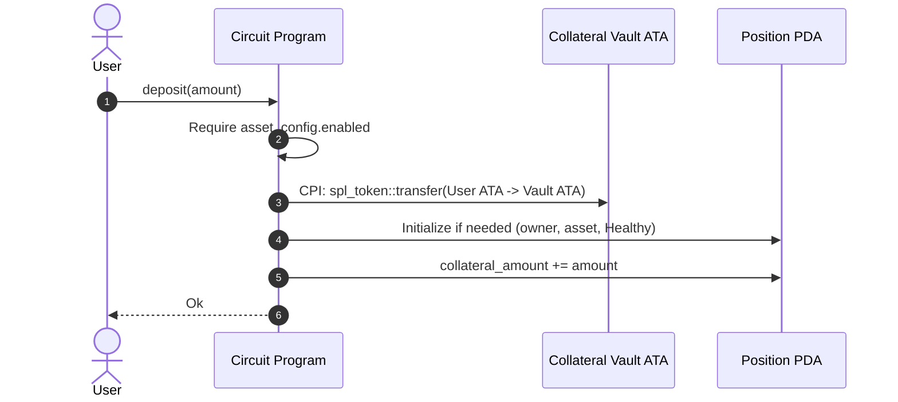
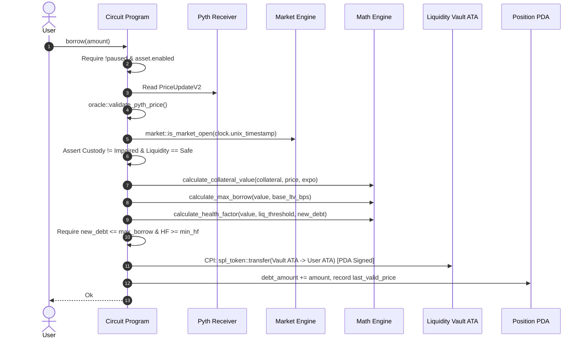
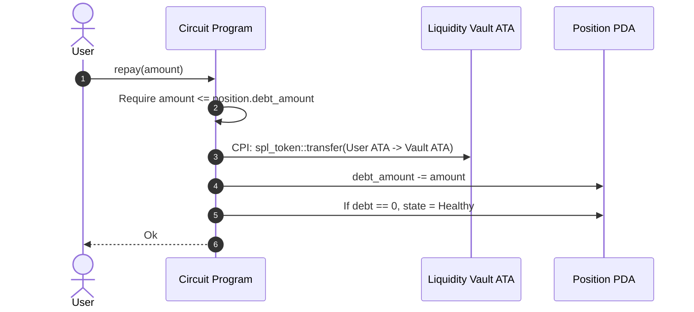
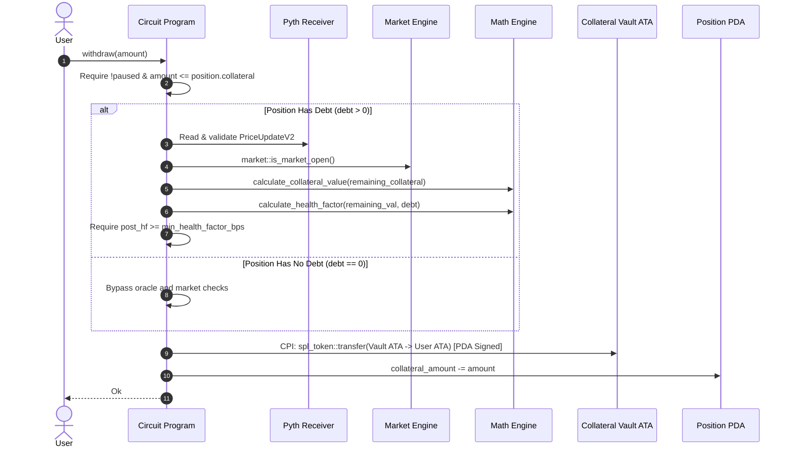
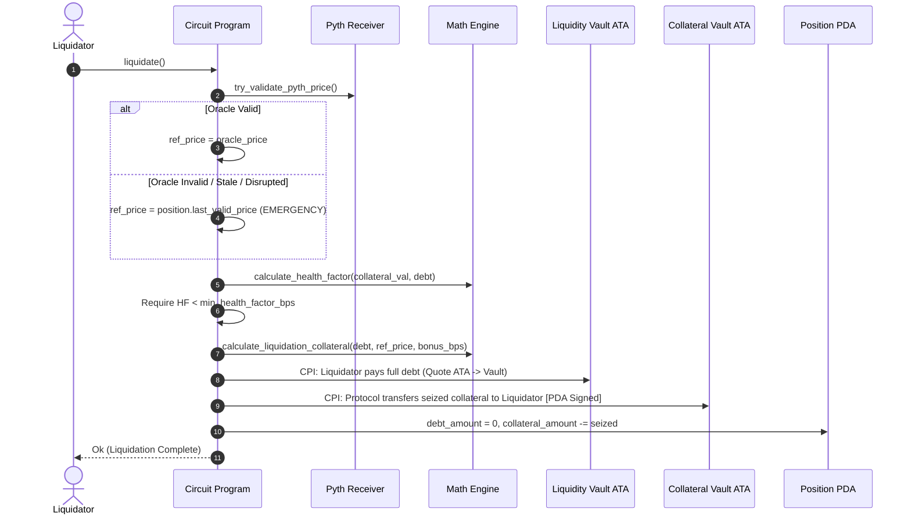
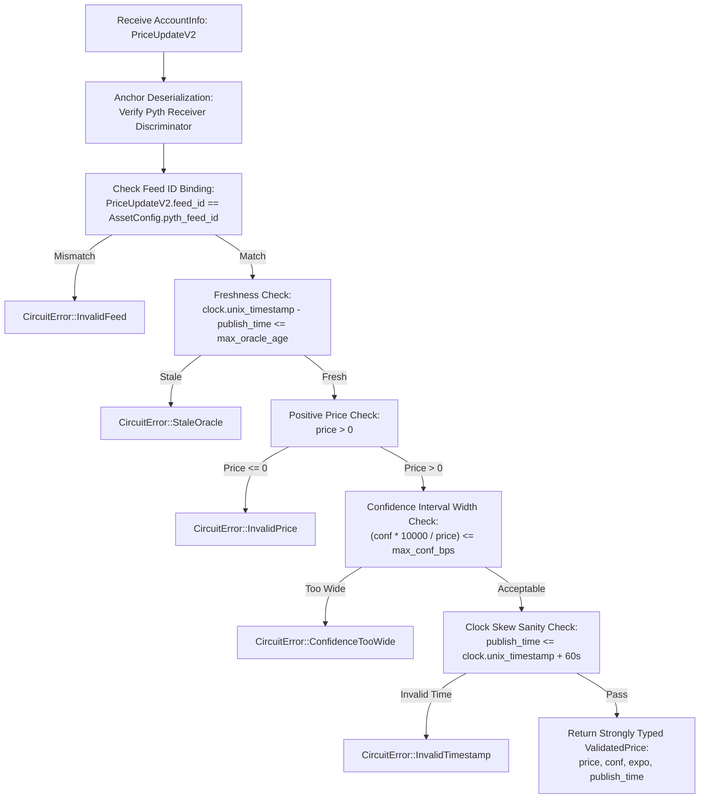
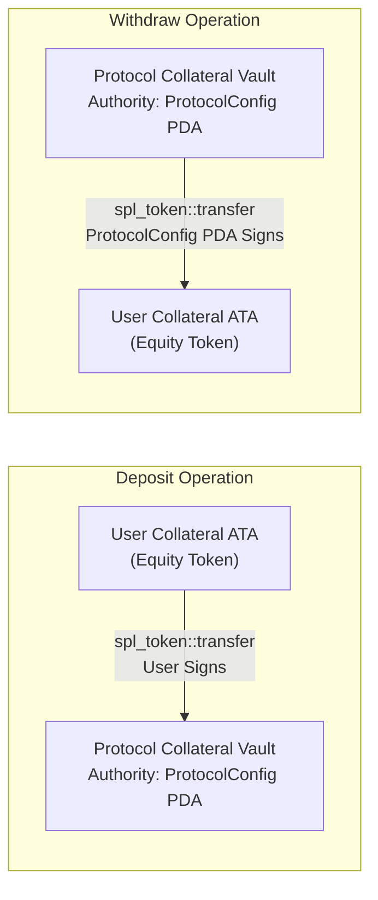
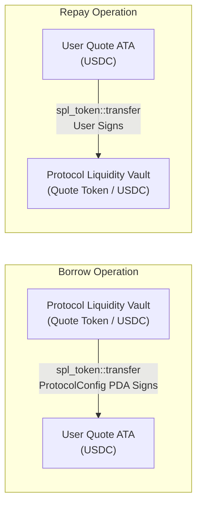
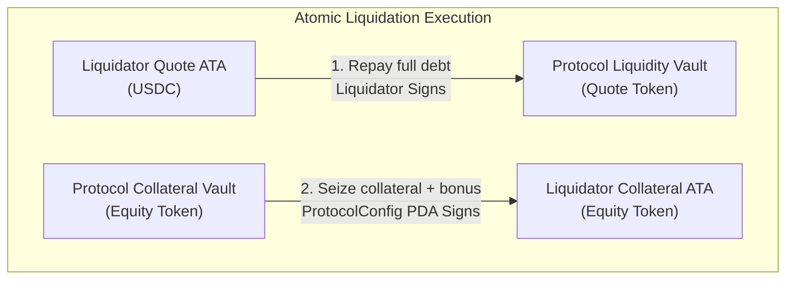

# Circuit Protocol: Architecture Specification

Circuit is a decentralized credit protocol on Solana designed specifically for tokenized equity collateral (e.g., tokenized stocks like NVDAx, AAPLx). It introduces continuous oracle validation, market-session awareness (NYSE regular trading hours), deterministic circuit breakers, and an emergency reference price policy to safely bridge traditional financial asset dynamics with Solana DeFi.

---

## 1. System Overview

Circuit isolates credit risk across distinct tokenized equity collateral mints while pooling quote token debt liquidity (such as USDC). Core operations rely on deterministic program-derived addresses (PDAs), strict SPL Token account bindings, and a centralized oracle boundary backed by the Pyth Network Solana Receiver.

### 1.1 High-Level Architecture Diagram



---

## 2. Module Structure

The program repository at [`programs/circuit/src/`](file:///c:/Dev/Circuit/programs/circuit/src) is organized into domain-specific, decoupled modules:

```
programs/circuit/src/
├── lib.rs                   # Anchor program entrypoint and instruction routing
├── errors.rs                # Comprehensive error enumeration (CircuitError)
├── state/                   # Onchain account state schemas and domain enums
│   ├── mod.rs
│   ├── protocol_config.rs   # Global protocol parameters (singleton)
│   ├── asset_config.rs      # Per-asset risk, oracle feed, and simulation state
│   ├── market_guard.rs      # Cached feed status and last valid price snapshot
│   ├── position.rs          # User debt and collateral state
│   └── enums.rs             # MarketState, CustodyState, LiquidityState, etc.
├── instructions/            # Instruction handlers and Anchor account contexts
│   ├── mod.rs
│   ├── initialize_protocol.rs
│   ├── register_asset.rs
│   ├── deposit.rs
│   ├── borrow.rs
│   ├── repay.rs
│   ├── withdraw.rs
│   ├── liquidate.rs
│   ├── refresh_guard.rs
│   ├── pause.rs
│   ├── set_custody_state.rs
│   └── set_liquidity_state.rs
├── oracle/                  # Centralized oracle decoding and sanitization
│   ├── mod.rs
│   └── validation.rs        # Single point of contact with pyth-solana-receiver-sdk
├── market/                  # Traditional market session schedule verification
│   ├── mod.rs
│   └── session.rs           # Deterministic NYSE regular trading calendar
└── math/                    # Fixed-point calculations and safety checks
    ├── mod.rs
    └── fixed_point.rs       # BPS scaling, LTV, collateral valuation, health factors
```

### Module Responsibilities

1. **`state`**
   - Defines onchain account storage, space requirements (`InitSpace`), and serialization schemas.
   - Enforces PDA seed prefixes as static constants (`ProtocolConfig::SEEDS`, `AssetConfig::SEEDS_PREFIX`, etc.).
   - Contains lifecycle enums: [`MarketState`](file:///c:/Dev/Circuit/programs/circuit/src/state/enums.rs#L8), [`CustodyState`](file:///c:/Dev/Circuit/programs/circuit/src/state/enums.rs#L28), [`LiquidityState`](file:///c:/Dev/Circuit/programs/circuit/src/state/enums.rs#L48), [`PositionState`](file:///c:/Dev/Circuit/programs/circuit/src/state/enums.rs#L70), and [`GuardReason`](file:///c:/Dev/Circuit/programs/circuit/src/state/enums.rs#L88).

2. **`instructions`**
   - Implements business logic and account constraints using Anchor macros (`#[derive(Accounts)]`).
   - Handles CPIs to the SPL Token program using PDA signer seeds.
   - Applies access control guards (`has_one = authority`, pause checks, and signer verification).

3. **`oracle`**
   - Centralizes all reads from Pyth Network `PriceUpdateV2` accounts in [`validation.rs`](file:///c:/Dev/Circuit/programs/circuit/src/oracle/validation.rs#L47).
   - Prevents unvalidated Pyth data from propagating to borrowing, withdrawal, or liquidation logic.
   - Emits strongly typed [`ValidatedPrice`](file:///c:/Dev/Circuit/programs/circuit/src/oracle/validation.rs#L12) structures.

4. **`market`**
   - Implements deterministic NYSE trading calendar rules in [`session.rs`](file:///c:/Dev/Circuit/programs/circuit/src/market/session.rs#L46).
   - Validates trading session hours (09:30 - 16:00 ET, early closes at 13:00 ET), weekends, US Eastern Daylight Time transitions, and observed market holidays.

5. **`math`**
   - Implements fixed-point arithmetic using standard 10,000 basis points (`BPS_SCALE = 10_000`).
   - Casts inputs to `u128` intermediates for all multiplications to prevent arithmetic overflow prior to division.
   - Disallows floating-point operations across all calculation paths.

6. **`errors`**
   - Centralized enum [`CircuitError`](file:///c:/Dev/Circuit/programs/circuit/src/errors.rs#L6) defining 28 distinct error codes for client and indexer observability.

---

## 3. PDA Derivation Formulas & Vault Bindings

Circuit uses canonical PDA derivation patterns to guarantee deterministic account binding and eliminate account substitution vulnerabilities.

| Account | Seeds Derivation Formula | Bump Storage | Description |
| :--- | :--- | :--- | :--- |
| **`ProtocolConfig`** | `[b"protocol"]` | `protocol_config.bump` | Global protocol singleton storing admin authority, pause flag, and defaults. |
| **`AssetConfig`** | `[b"asset", equity_mint.as_ref()]` | `asset_config.bump` | Per-collateral configuration binding the equity mint to its Pyth feed and risk params. |
| **`MarketGuard`** | `[b"guard", pyth_feed_id.as_ref()]` | `market_guard.bump` | Cached market status and last-valid oracle snapshot for a 32-byte Pyth feed ID. |
| **`Position`** | `[b"position", owner.as_ref(), equity_mint.as_ref()]` | `position.bump` | Per-(owner, asset) ledger tracking deposited collateral and borrowed debt. |
| **Collateral Vault** | `get_associated_token_address(protocol_config_pda, equity_mint)` | SPL ATA Standard | Associated token account holding deposited equity collateral. Authority: `ProtocolConfig`. |
| **Liquidity Vault** | `get_associated_token_address(protocol_config_pda, quote_mint)` | SPL ATA Standard | Associated token account holding quote token debt liquidity. Authority: `ProtocolConfig`. |

### Anchor Account Derivation Contexts

- **ProtocolConfig PDA**:
  ```rust
  seeds = [ProtocolConfig::SEEDS],
  bump
  ```
- **AssetConfig PDA**:
  ```rust
  seeds = [AssetConfig::SEEDS_PREFIX, mint.key().as_ref()],
  bump
  ```
- **MarketGuard PDA**:
  ```rust
  seeds = [MarketGuard::SEEDS_PREFIX, &pyth_feed_id],
  bump
  ```
- **Position PDA**:
  ```rust
  seeds = [Position::SEEDS_PREFIX, owner.key().as_ref(), asset_config.mint.as_ref()],
  bump
  ```
- **Vault Token Signer Seeds**:
  ```rust
  let seeds = &[ProtocolConfig::SEEDS, &[protocol.bump]];
  let signer_seeds = &[&seeds[..]];
  ```

---

## 4. Instruction Execution & Data Flows

### 4.1 `deposit(amount: u64)`
- **Target**: Deposit tokenized equity collateral into the protocol.
- **Constraints**:
  - `amount > 0`.
  - `asset_config.enabled == true`.
  - Allowed when protocol is paused (deposits reduce leverage and user risk).
- **Flow**:
  1. Transfer `amount` of `mint` from `user_collateral_ata` to protocol `collateral_vault` via SPL CPI.
  2. If `position` is newly initialized via `init_if_needed`, set `owner = owner.key()`, `asset = mint`, `debt_amount = 0`, `state = Healthy`.
  3. Increment `position.collateral_amount = position.collateral_amount + amount`.



### 4.2 `borrow(amount: u64)`
- **Target**: Borrow quote tokens (USDC) against deposited collateral.
- **Constraints**:
  - `amount > 0`.
  - Protocol NOT paused (`!protocol_config.paused`).
  - Asset enabled (`asset_config.enabled`).
  - Signer is position owner (`position.owner == owner.key()`).
  - Oracle valid, fresh, within confidence limit.
  - NYSE session open (`market::is_market_open(clock.unix_timestamp) == true`).
  - Custody not impaired (`custody_state != Impaired`).
  - Liquidity not impaired (`liquidity_state != Critical && != Thin`).
  - New total debt `<= max_borrow` (based on fixed `base_ltv_bps`).
  - Resulting `HF >= protocol_config.min_health_factor_bps`.
  - Protocol `liquidity_vault` has balance `>= amount`.
- **Flow**:
  1. Centralized oracle validation via [`validate_pyth_price`](file:///c:/Dev/Circuit/programs/circuit/src/oracle/validation.rs#L47).
  2. Evaluate deterministic NYSE session via [`is_market_open`](file:///c:/Dev/Circuit/programs/circuit/src/market/session.rs#L46).
  3. Validate custody and liquidity simulation states.
  4. Compute collateral value scaled to quote decimals using [`calculate_collateral_value`](file:///c:/Dev/Circuit/programs/circuit/src/math/fixed_point.rs#L42).
  5. Compute borrow headroom and health factor.
  6. Transfer `amount` quote tokens from `liquidity_vault` to `user_quote_ata` using `ProtocolConfig` PDA signer seeds.
  7. Update `position.debt_amount`, `position.last_valid_price`, and `position.last_valid_expo`.



### 4.3 `repay(amount: u64)`
- **Target**: Repay outstanding debt in quote tokens.
- **Constraints**:
  - `amount > 0`.
  - Signer is position owner (`position.owner == owner.key()`).
  - `amount <= position.debt_amount` (rejects over-repayment in MVP).
  - Always allowed, even when protocol is paused.
- **Flow**:
  1. Transfer `amount` of `quote_mint` from `user_quote_ata` to `liquidity_vault` via SPL CPI.
  2. Decrement `position.debt_amount = position.debt_amount - amount`.
  3. If `debt_amount == 0`, ensure `position.state = PositionState::Healthy`.



### 4.4 `withdraw(amount: u64)`
- **Target**: Withdraw tokenized equity collateral.
- **Constraints**:
  - `amount > 0`.
  - Protocol NOT paused (`!protocol_config.paused`).
  - Signer is position owner (`position.owner == owner.key()`).
  - `amount <= position.collateral_amount`.
  - If `position.debt_amount > 0`:
    - Full oracle re-validation.
    - NYSE regular session must be open.
    - Custody and liquidity must be Safe.
    - Post-withdrawal health factor must remain `>= min_health_factor_bps`.
- **Flow**:
  1. Calculate `remaining_collateral = collateral_amount - amount`.
  2. If `debt_amount > 0`, execute full oracle, market, and math checks on remaining collateral.
  3. Transfer `amount` collateral from `collateral_vault` to `user_collateral_ata` using `ProtocolConfig` PDA signer seeds.
  4. Decrement `position.collateral_amount`. If validated against oracle, update `position.last_valid_price`.



### 4.5 `liquidate()`
- **Target**: Seize collateral and extinguish bad debt of an unhealthy position.
- **Constraints**:
  - Permissionless (any user/bot can call).
  - Allowed when paused (preserves protocol solvency).
  - Position must have debt (`position.debt_amount > 0`).
  - Evaluated health factor must be `< min_health_factor_bps`.
- **Flow**:
  1. Read oracle via [`try_validate_pyth_price`](file:///c:/Dev/Circuit/programs/circuit/src/oracle/validation.rs#L89).
  2. If oracle is valid, use current price. If invalid or stale, activate **Emergency Price Policy** and use `position.last_valid_price`.
  3. Compute collateral value and health factor at reference price. Require `HF < min_health_factor_bps`.
  4. Calculate collateral seizure: `collateral_to_seize = (debt * (10000 + bonus_bps)) / ref_price`.
  5. Clamp seizure to `position.collateral_amount`.
  6. Transfer total debt quote tokens from liquidator to `liquidity_vault`.
  7. Transfer seized collateral from `collateral_vault` to liquidator via `ProtocolConfig` PDA signer seeds.
  8. Clear `position.debt_amount = 0`, decrement collateral, and reset position to `Healthy`.



### 4.6 `refresh_guard()`
- **Target**: Update cached observability status on [`MarketGuard`](file:///c:/Dev/Circuit/programs/circuit/src/state/market_guard.rs#L16).
- **Constraints**:
  - Permissionless.
  - Can be invoked by UI crankers or monitoring bots at any time.
- **Flow**:
  1. Inspects Pyth oracle account freshness and confidence width.
  2. Evaluates NYSE market session, custody state, and liquidity state.
  3. Derives new `MarketState` (`Safe`, `Restricted`, or `Emergency`) and `GuardReason`.
  4. Stores derived state and current Solana slot in `MarketGuard`.
  5. If oracle is valid, updates `last_valid_price`, `last_valid_expo`, and `last_publish_time`.

---

## 5. Oracle Validation Engine

All oracle data consumption passes through [`validate_pyth_price`](file:///c:/Dev/Circuit/programs/circuit/src/oracle/validation.rs#L47) in [`oracle/validation.rs`](file:///c:/Dev/Circuit/programs/circuit/src/oracle/validation.rs). No raw Pyth structures or unverified price feeds are permitted anywhere in instruction handlers.



### Pyth Receiver Integration Details
- **Receiver Program ID**: `rec5EKMGg6MxZYaMdyBfgwp4d5rB9T1VQH5pJv5LtFJ`
  - This is the ID declared by `pyth-solana-receiver-sdk` v2.0.0 with the `pro-compatible` feature **off**, which is how this program builds. The `pro-compatible` variant (`rec2HHDDnjLfj4kE7VyEtFA1HPGQLK33259532cRyHp`) is a different program; supplying an account owned by it fails Anchor deserialization before any protocol logic runs.
- **Price account discovery**: sponsored feeds are PDAs of the push-oracle program `pythWSnswVUd12oZpeFP8e9CVaEqJg25g1Vtc2biRsT`, seeded by a little-endian `u16` shard id followed by the 32-byte feed id. Devnet retains **stale accounts on higher shards** alongside a live shard 0, so tooling selects the freshest shard rather than the first that exists (`scripts/lib/pyth.ts`).
- **Default Feed (devnet)**: SOL/USD `0xef0d8b6fda2ceba41da15d4095d1da392a0d2f8ed0c6c7bc0f4cfac8c280b56d`
  - Tokenized-equity feeds are generally **not** sponsored on devnet, so the demo defaults to a feed that actually exists there. Verify any candidate with `npm run check:oracle` before registering it.
- **SDK**: `pyth-solana-receiver-sdk = "2.0.0"`
- **Anchor CPI Deserialization**:
  The instruction accounts deserialize `PriceUpdateV2` directly:
  ```rust
  pub price_update: Account<'info, PriceUpdateV2>,
  ```
  Validation invokes the Pyth SDK method:
  ```rust
  let price_data = price_update
      .get_price_no_older_than(clock, max_age, expected_feed_id)
      .map_err(|_| error!(CircuitError::StaleOracle))?;
  ```

---

## 6. Deterministic Market Session Engine

Tokenized equities trade based on the regular trading hours of the underlying reference exchange (NYSE). Outside of market hours, price formation in equity markets is illiquid and prone to severe gaps. Circuit incorporates a deterministic calendar engine in [`market/session.rs`](file:///c:/Dev/Circuit/programs/circuit/src/market/session.rs).

### Session Rules
1. **Regular Trading Hours (Core Session)**:
   - Opens: 09:30 AM US Eastern Time (`MARKET_OPEN_HOUR = 9`, `MARKET_OPEN_MIN = 30`).
   - Closes: 04:00 PM US Eastern Time (`MARKET_CLOSE_HOUR = 16`, `MARKET_CLOSE_MIN = 0`).
2. **Early Close Days**:
   - Day before Independence Day (observed July 3 in 2025).
   - Day after Thanksgiving (Black Friday).
   - Christmas Eve (December 24).
   - Core session closes at 01:00 PM US Eastern Time (`13:00 ET`).
3. **Weekends**:
   - Closed Saturdays and Sundays (`dow >= 5`).
4. **Eastern Time & Daylight Saving Time (DST)**:
   - Dynamic calculation based on US rules:
     - Eastern Daylight Time (EDT, UTC -4 hours): 2nd Sunday in March to 1st Sunday in November.
     - Eastern Standard Time (EST, UTC -5 hours): Remainder of the year.
5. **Observed Holidays (2025–2026 Table)**:
   - New Year's Day, MLK Day, Washington's Birthday (Presidents Day), Good Friday, Memorial Day, Juneteenth National Independence Day, Independence Day, Labor Day, Thanksgiving Day, Christmas Day.
   - Special National Days of Mourning (e.g., Jimmy Carter: Jan 9, 2025).

> [!NOTE]
> The MVP market calendar is deterministic and implemented in pure onchain Rust using Howard Hinnant's civil date algorithm and Tomohiko Sakamoto's day-of-week formula. It does not require external oracle calls for session boundaries.

---

## 7. Math Formulation & Health Factor

All math operations are contained in [`math/fixed_point.rs`](file:///c:/Dev/Circuit/programs/circuit/src/math/fixed_point.rs). All percentages and ratios use basis points where `10_000 BPS = 100.00%`.

### 7.1 Collateral Valuation
Given collateral token amount $A$ (in collateral native units with decimals $d_c$), Pyth price $P$ (integer with exponent $e$), and quote token decimals $d_q$:

$$\text{raw\_value} = A \times P$$
$$\text{net\_expo} = d_q - d_c + e$$
$$\text{collateral\_value} = \begin{cases} \text{raw\_value} \times 10^{\text{net\_expo}}, & \text{if } \text{net\_expo} \ge 0 \\ \lfloor \frac{\text{raw\_value}}{10^{|\text{net\_expo}|}} \rfloor, & \text{if } \text{net\_expo} < 0 \end{cases}$$

### 7.2 Maximum Borrow Capacity
Given collateral value $V$ and base loan-to-value ratio $LTV_{\text{bps}}$:

$$\text{max\_borrow} = \lfloor \frac{V \times LTV_{\text{bps}}}{10000} \rfloor$$

### 7.3 Health Factor
Health Factor ($HF$) measures position safety. If total debt $D = 0$, $HF = \infty$ (`HF_INFINITE = u64::MAX`). For $D > 0$:

$$HF = \lfloor \frac{V \times \text{liquidation\_threshold\_bps} \times 10000}{D \times 10000} \rfloor = \lfloor \frac{V \times \text{liquidation\_threshold\_bps}}{D} \rfloor$$

- If $HF \ge \text{min\_health\_factor\_bps}$ (e.g., `10000` or $1.0\times$): Position is healthy.
- If $HF < \text{min\_health\_factor\_bps}$: Position is liquidatable.

### 7.4 Liquidation Seizure Amount
When liquidating debt $D$ at reference price $P$ with liquidation bonus $B_{\text{bps}}$ (e.g., 500 BPS = 5%):

$$\text{debt\_with\_bonus} = \lfloor \frac{D \times (10000 + B_{\text{bps}})}{10000} \rfloor$$

Converting debt to collateral units (rounding up to protect protocol solvency):

$$\text{seizure} = \lceil \frac{\text{debt\_with\_bonus} \times 10^{d_c}}{P \times 10^{d_q + e}} \rceil$$
$$\text{actual\_seizure} = \min(\text{seizure}, \text{position.collateral\_amount})$$

---

## 8. Emergency Price Policy

Circuit implements a resilient fallback mechanism during oracle outages, confidence blowouts, or off-market price feed disruptions:

1. **Snapshot on Valid Operations**:
   - Whenever an oracle price is successfully validated during a [`borrow`](file:///c:/Dev/Circuit/programs/circuit/src/instructions/borrow.rs) or [`withdraw`](file:///c:/Dev/Circuit/programs/circuit/src/instructions/withdraw.rs) call, the price and exponent are stored in `position.last_valid_price` and `position.last_valid_expo`.
   - Whenever [`refresh_guard`](file:///c:/Dev/Circuit/programs/circuit/src/instructions/refresh_guard.rs) successfully validates the oracle, it writes the price and exponent to `market_guard.last_valid_price` and `market_guard.last_valid_expo`.
2. **Oracle Invalidation Never Overwrites Valid Snapshot**:
   - An invalid or stale oracle update leaves `last_valid_price` intact.
3. **Liquidation Fallback**:
   - During [`liquidate`](file:///c:/Dev/Circuit/programs/circuit/src/instructions/liquidate.rs), the contract executes [`try_validate_pyth_price`](file:///c:/Dev/Circuit/programs/circuit/src/oracle/validation.rs#L89).
   - If validation fails (due to staleness, wide confidence, or off-hours disruption), liquidation **does not revert**. Instead, it loads `position.last_valid_price`.
   - This ensures underwater positions can still be liquidated to protect protocol solvency even during prolonged oracle failure.

---

## 9. MarketGuard State Derivation Priority

The [`MarketGuard`](file:///c:/Dev/Circuit/programs/circuit/src/state/market_guard.rs) state is derived deterministically using a strict priority ladder. Lower priority conditions cannot mask higher severity failures:

| Priority | Condition | Derived `MarketState` | Resulting `GuardReason` | Impact on Borrow / Withdraw |
| :---: | :--- | :--- | :--- | :--- |
| **1** | Oracle invalid, stale, or confidence too wide | `Emergency` | `StaleOracle` / `ConfidenceTooWide` | Borrow blocked. Withdraw blocked if debt > 0. Liquidate uses last valid price. |
| **2** | Custody state == `Impaired` | `Emergency` | `CustodyImpaired` | Borrow blocked. Withdraw blocked if debt > 0. |
| **3** | Liquidity state == `Critical` | `Emergency` | `LiquidityCritical` | Borrow blocked. Withdraw blocked if debt > 0. |
| **4** | Reference market session closed | `Restricted` | `MarketClosed` | Borrow blocked. Withdraw blocked if debt > 0. Liquidations continue. |
| **5** | Liquidity state == `Thin` | `Restricted` | `LiquidityThin` | Borrow blocked. Withdraw blocked if debt > 0. |
| **6** | Custody state == `Delayed` | `Restricted` | `CustodyImpaired` | Borrow blocked. Withdraw blocked if debt > 0. |
| **7** | All checks pass | `Safe` | `Ok` | All operations fully enabled. |

> [!IMPORTANT]
> The cached `MarketGuard` PDA is strictly for UI and off-chain observability. Every `borrow` and `withdraw` instruction re-evaluates all priority checks independently at runtime.

---

## 10. Access Control Matrix

| Instruction | Required Signer | Authority Check | Target Accounts Mutated |
| :--- | :--- | :--- | :--- |
| `initialize_protocol` | Admin Keypair | PDA init (single-shot) | `ProtocolConfig` |
| `register_asset` | Admin Keypair | `has_one = authority` on `ProtocolConfig` | `AssetConfig`, `MarketGuard`, Vault ATAs |
| `set_custody_state` | Admin Keypair | `authority == ProtocolConfig.authority` | `AssetConfig` |
| `set_liquidity_state` | Admin Keypair | `authority == ProtocolConfig.authority` | `AssetConfig` |
| `pause_protocol` | Admin Keypair | `authority == ProtocolConfig.authority` | `ProtocolConfig` |
| `unpause_protocol` | Admin Keypair | `authority == ProtocolConfig.authority` | `ProtocolConfig` |
| `refresh_guard` | Any Signer | Permissionless | `MarketGuard` |
| `deposit` | User (Position Owner) | Signer is payer/owner | `Position`, `collateral_vault`, User ATA |
| `borrow` | User (Position Owner) | `position.owner == owner.key()` | `Position`, `liquidity_vault`, User ATA |
| `repay` | User (Position Owner) | `position.owner == owner.key()` | `Position`, `liquidity_vault`, User ATA |
| `withdraw` | User (Position Owner) | `position.owner == owner.key()` | `Position`, `collateral_vault`, User ATA |
| `liquidate` | Any Liquidator | Permissionless | `Position`, `collateral_vault`, `liquidity_vault`, Liquidator ATAs |

---

## 11. Protocol Pause Behavior Matrix

When the protocol is paused via `pause_protocol`, risk-increasing operations are halted immediately, while risk-reducing and liquidation operations remain operational:

| Instruction | Allowed When Paused? | Rationale |
| :--- | :---: | :--- |
| `deposit` | **YES** | Increases position collateralization and reduces protocol credit risk. |
| `repay` | **YES** | Reduces position debt. Prevents trapping user capital during emergency periods. |
| `liquidate` | **YES** | Essential for protocol solvency; clears underwater debt during market volatility. |
| `refresh_guard` | **YES** | Read/observability crank; updates cached state without touching balances. |
| `borrow` | **NO** | Risk-increasing; prevents new debt creation when protocol is in pause state. |
| `withdraw` | **NO** | Risk-increasing; prevents collateral depletion during security incidents. |
| `register_asset` | **YES** | Administrative action permitted for asset management. |
| `set_custody_state` | **YES** | Admin action to adjust simulation parameters. |
| `set_liquidity_state` | **YES** | Admin action to adjust simulation parameters. |

---

## 12. Token Flow Diagrams

### 12.1 Collateral Flow (Deposit vs Withdraw)



### 12.2 Debt Liquidity Flow (Borrow vs Repay)



### 12.3 Liquidation Flow (Atomic Multi-Token Settlement)


