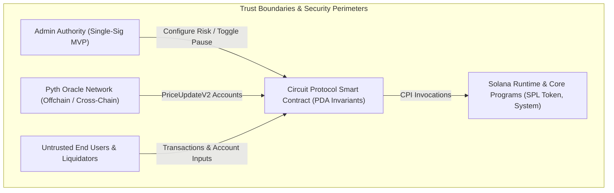
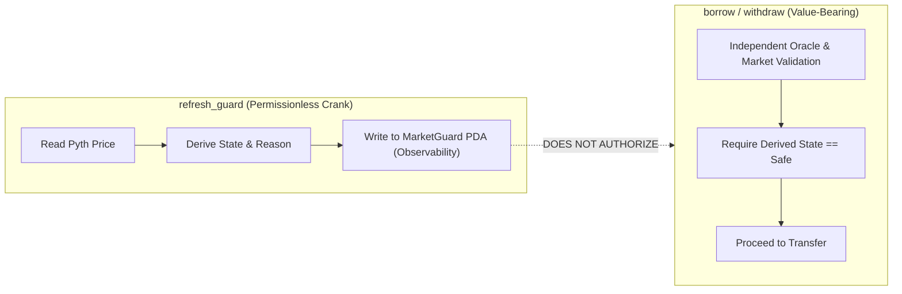

# Circuit Protocol: Security Model & Verification

This document details the security architecture, threat assumptions, formal invariants, and implementation safeguards of the Circuit Protocol on Solana. Circuit turns tokenized equities into programmable collateral, integrating onchain credit operations with offchain financial market realities.

---

## 1. Trust Model & System Assumptions

Circuit operates within a multi-party environment comprising the protocol deployer/governance, tokenized equity custodians, Pyth oracle networks, liquidators, and end users.



### Core Security Invariants
1. **Collateralization Invariant**: No borrower can withdraw collateral or mint new debt such that the resulting position health factor falls below `min_health_factor_bps`.
2. **Authority Non-Bypass Invariant**: Administrative authority cannot directly withdraw collateral or borrow funds from protocol vaults without supplying legitimate collateral and passing all oracle and health factor checks.
3. **Deterministic Derivation Invariant**: No account can be substituted for an arbitrary signer or keypair; all state accounts and vaults are bound to program-derived addresses (PDAs) with canonical seeds.
4. **Fund Trapping Prevention Invariant**: Even under emergency pause or market closure, borrowers retain the ability to repay their debt and liquidators retain the ability to clear underwater positions.

---

## 2. Admin Trust Assumptions (MVP Scope)

In the current MVP implementation, administrative authority is held by a single cryptographic keypair stored in [`ProtocolConfig.authority`](file:///c:/Dev/Circuit/programs/circuit/src/state/protocol_config.rs#L13). The scope and limits of this trust boundary are strictly demarcated:

### What the Admin CAN Do
- **Toggle Pause State**: Invoke [`pause_protocol`](file:///c:/Dev/Circuit/programs/circuit/src/instructions/pause.rs#L13) or [`unpause_protocol`](file:///c:/Dev/Circuit/programs/circuit/src/instructions/pause.rs#L24) to freeze risk-increasing operations across the protocol.
- **Register Collateral Assets**: Invoke [`register_asset`](file:///c:/Dev/Circuit/programs/circuit/src/instructions/register_asset.rs#L11) to define supported equity mints, Pyth feed IDs, LTV ratios, and liquidation parameters.
- **Set Simulation Inputs**: Invoke [`set_custody_state`](file:///c:/Dev/Circuit/programs/circuit/src/instructions/set_custody_state.rs#L11) and [`set_liquidity_state`](file:///c:/Dev/Circuit/programs/circuit/src/instructions/set_liquidity_state.rs#L11) to simulate upstream custodian or liquidity degradation during MVP testing.
- **Configure Economic Parameters**: Invoke [`update_fee_config`](file:///c:/Dev/Circuit/programs/circuit/src/instructions/update_fee_config.rs) to adjust `borrow_fee_bps` (hard-capped on-chain at `<= 1,000 BPS` / 10%) or migrate `fee_recipient` to a multisig treasury.

### What the Admin CANNOT Do
- **Cannot Exceed Fee Safety Cap**: The smart contract enforces `fee_bps <= MAX_BORROW_FEE_BPS` (1,000 BPS / 10.00%). Admin cannot impose predatory fees.
- **Cannot Divert Fees Arbitrarily**: `borrow.rs` enforces `treasury_quote_ata.owner == protocol_config.fee_recipient`. Borrowers cannot be forced to pay unconfigured accounts.
- **Cannot Forge Oracle Prices**: The protocol enforces cryptographic deserialization of Pyth `PriceUpdateV2` accounts verified by the Pyth Solana Receiver Program (`rec5EKMGg6MxZYaMdyBfgwp4d5rB9T1VQH5pJv5LtFJ`). The admin cannot supply arbitrary price values.
- **Cannot Steal Vault Collateral**: Vault accounts are owned by the `ProtocolConfig` PDA (`["protocol"]`). The admin key is NOT the token authority; only the program itself, via PDA signer seeds during legitimate borrowing, withdrawal, or liquidation CPIs, can transfer tokens from the vaults.
- **Cannot Bypass Health Factors**: The admin cannot alter individual position balances or force an undercollateralized borrow.
- **Cannot Prevent Debt Repayment**: The admin pause mechanism specifically leaves [`repay`](file:///c:/Dev/Circuit/programs/circuit/src/instructions/repay.rs#L11) operational, ensuring borrowers can always extinguish debt.

---

## 3. Oracle Security Architecture

Circuit relies on high-fidelity, real-time price feeds for equity assets. Oracle ingestion is isolated in [`programs/circuit/src/oracle/validation.rs`](file:///c:/Dev/Circuit/programs/circuit/src/oracle/validation.rs).

### 3.1 Centralized Validation Gateway
All oracle reads pass through a single gateway: [`validate_pyth_price`](file:///c:/Dev/Circuit/programs/circuit/src/oracle/validation.rs#L47). No instruction handler parses Pyth data independently. This prevents fragmentation of oracle security assumptions.

```rust
pub fn validate_pyth_price(
    price_update: &PriceUpdateV2,
    expected_feed_id: &[u8; 32],
    max_age: u64,
    max_conf_bps: u64,
    clock: &Clock,
) -> Result<ValidatedPrice>
```

### 3.2 Feed ID Cryptographic Binding
Each asset registered in [`AssetConfig`](file:///c:/Dev/Circuit/programs/circuit/src/state/asset_config.rs#L12) is permanently bound to a 32-byte Pyth price feed ID:
```rust
pub pyth_feed_id: [u8; 32]
```
During validation, `get_price_no_older_than` explicitly verifies that the feed ID inside the verified Pyth account matches `AssetConfig.pyth_feed_id`. An attacker cannot provide a price feed for a volatile or fake asset (e.g., BTC or a test token) when interacting with NVDA collateral.

### 3.3 Strict Staleness Enforcement
Oracle prices must have been published within `max_oracle_age` seconds relative to the Solana cluster timestamp:
```rust
clock.unix_timestamp - price_data.publish_time <= max_age
```
If the delta exceeds `max_age`, the transaction reverts with [`CircuitError::StaleOracle`](file:///c:/Dev/Circuit/programs/circuit/src/errors.rs#L28). This eliminates replay attacks using historical or favorable price ticks.

### 3.4 Confidence Interval Gating
Pyth publishes a confidence interval ($\sigma$) representing the uncertainty range of the aggregated quote. Circuit enforces a strict confidence threshold in [`is_confidence_acceptable`](file:///c:/Dev/Circuit/programs/circuit/src/math/fixed_point.rs#L230):
$$\frac{\text{conf} \times 10000}{\text{price}} \le \text{max\_conf\_bps}$$
If the confidence spread widens beyond `max_conf_bps` (e.g., during market open auction volatility or severe provider disagreement), the price is rejected with [`CircuitError::ConfidenceTooWide`](file:///c:/Dev/Circuit/programs/circuit/src/errors.rs#L32).

### 3.5 Clock Skew Protection
To guard against anomalous offchain timestamps, the engine rejects prices published more than 60 seconds into the cluster's future:
```rust
let max_future = clock.unix_timestamp.checked_add(60).ok_or(CircuitError::MathOverflow)?;
require!(price_data.publish_time <= max_future, CircuitError::InvalidTimestamp);
```

---

## 4. PDA Validation & Canonical Derivations

Solana applications are susceptible to account substitution attacks if program-derived addresses are not strictly verified. Circuit protects against this via canonical Anchor seeds and bump constraints on all state accounts:

```rust
// ProtocolConfig
seeds = [ProtocolConfig::SEEDS], bump = protocol_config.bump

// AssetConfig
seeds = [AssetConfig::SEEDS_PREFIX, mint.key().as_ref()], bump = asset_config.bump

// MarketGuard
seeds = [MarketGuard::SEEDS_PREFIX, &asset_config.pyth_feed_id], bump = market_guard.bump

// Position
seeds = [Position::SEEDS_PREFIX, owner.key().as_ref(), asset_config.mint.as_ref()], bump = position.bump
```

- **Collateral Isolation**: User positions cannot collide across assets or owners because the user's wallet `Pubkey` and the equity `mint` are hashed directly into the PDA seeds.
- **Single-Shot Initialization**: Protocol and asset configurations cannot be re-initialized because Anchor's `init` constraint verifies that the target PDA has zero lamports and no existing data discriminator.

---

## 5. Token Account & Mint Validation

To prevent malicious fake tokens or unauthorized token accounts from being passed into lending workflows, Circuit implements multi-level account constraints:

1. **Mint Verification**:
   ```rust
   #[account(
       constraint = collateral_mint.key() == asset_config.mint @ CircuitError::InvalidMint,
   )]
   pub collateral_mint: Account<'info, Mint>,

   #[account(
       constraint = quote_mint.key() == asset_config.quote_mint @ CircuitError::InvalidMint,
   )]
   pub quote_mint: Account<'info, Mint>,
   ```
2. **Vault Derivation via Associated Token Program**:
   Vaults are strictly derived as the Associated Token Account (ATA) of the `ProtocolConfig` PDA:
   ```rust
   #[account(
       mut,
       associated_token::mint = collateral_mint,
       associated_token::authority = protocol_config,
   )]
   pub collateral_vault: Account<'info, TokenAccount>,
   ```
3. **User Account Ownership Verification**:
   Borrower and liquidator ATAs are checked for both mint compatibility and owner authorization:
   ```rust
   #[account(
       mut,
       token::mint = quote_mint,
       token::authority = owner,
   )]
   pub user_quote_ata: Account<'info, TokenAccount>,
   ```

---

## 6. Arithmetic Safety & Precision

Circuit employs a defense-in-depth approach to numerical computation in [`programs/circuit/src/math/fixed_point.rs`](file:///c:/Dev/Circuit/programs/circuit/src/math/fixed_point.rs):

- **No Floating Point**: The Solana BPF runtime does not guarantee deterministic IEEE-754 floating-point operations across hardware architectures. Circuit uses integer fixed-point arithmetic scaled by $10,000$ (`BPS_SCALE = 10_000`).
- **`u128` Intermediates**: All multiplications between token quantities, prices, and basis-point ratios are cast to `u128` prior to calculation. This prevents multiplication overflow before subsequent division.
- **Checked Arithmetic**: Every arithmetic step utilizes Rust's `.checked_add()`, `.checked_sub()`, and `.checked_mul()` methods, mapping failures to [`CircuitError::MathOverflow`](file:///c:/Dev/Circuit/programs/circuit/src/errors.rs#L76).
- **Conservative Rounding Directions**:
  - **Collateral Valuation**: Truncates downwards (`floor`) to prevent overestimating borrower capacity.
  - **Max Borrow**: Truncates downwards (`floor`).
  - **Liquidation Seizure**: Rounds upwards (`ceil`) on collateral seizure to ensure total bad debt is extinguished and liquidators are properly incentivized.
- **No Unwraps on Execution Paths**: There are zero instances of `.unwrap()` or `.expect()` in non-test production code. All computations return explicit `Result<T, CircuitError>`.

---

## 7. MarketGuard Security & Observability Decoupling

A critical architectural security rule in Circuit is that **cached state must never be the sole authorization mechanism for value transfers**:



- The [`refresh_guard`](file:///c:/Dev/Circuit/programs/circuit/src/instructions/refresh_guard.rs#L24) instruction can be called permissionlessly by anyone to update [`MarketGuard`](file:///c:/Dev/Circuit/programs/circuit/src/state/market_guard.rs#L16).
- If an attacker manipulates the timing of a `refresh_guard` call or if a cached slot becomes stale, [`borrow`](file:///c:/Dev/Circuit/programs/circuit/src/instructions/borrow.rs#L35-L56) and [`withdraw`](file:///c:/Dev/Circuit/programs/circuit/src/instructions/withdraw.rs#L45-L64) **do not read `MarketGuard.market_state`**. Instead, they re-validate the oracle account, NYSE trading calendar, custody status, and liquidity status in the current transaction execution frame.

---

## 8. Pause Mechanism Safety

Protocols often introduce existential security risks through pause mechanisms that permanently lock user capital:

- **Repayments Always Open**: [`repay`](file:///c:/Dev/Circuit/programs/circuit/src/instructions/repay.rs#L11) does not check `protocol_config.paused`. Borrowers can always eliminate debt, eliminate margin risk, and protect against liquidation.
- **Deposits Always Open**: [`deposit`](file:///c:/Dev/Circuit/programs/circuit/src/instructions/deposit.rs#L12) is permitted while paused. Adding collateral increases solvency and lowers system leverage.
- **Liquidations Always Open**: [`liquidate`](file:///c:/Dev/Circuit/programs/circuit/src/instructions/liquidate.rs#L26) is permitted while paused. A paused protocol cannot prevent third-party liquidators from eliminating bad debt during systemic emergencies.
- **Symmetric Unpause**: Only the designated protocol authority can unpause the program via [`unpause_protocol`](file:///c:/Dev/Circuit/programs/circuit/src/instructions/pause.rs#L24).

---

## 9. Liquidation Safety & Emergency Reference Price

Circuit's liquidation engine in [`programs/circuit/src/instructions/liquidate.rs`](file:///c:/Dev/Circuit/programs/circuit/src/instructions/liquidate.rs) guarantees deterministic solvency without creating unbacked debt:

### 9.1 The Emergency Price Snapshot
When equity markets experience extreme volatility or exchange halting, Pyth feeds may become stale or wide. Traditional protocols freeze entirely, allowing undercollateralized debt to accumulate unliquidated. Circuit handles this via its **Emergency Price Policy**:
1. When [`liquidate`](file:///c:/Dev/Circuit/programs/circuit/src/instructions/liquidate.rs#L37) executes, it attempts to validate the live oracle.
2. If the live oracle is stale or exceeds confidence limits, it falls back to `position.last_valid_price`.
3. `position.last_valid_price` is an immutable onchain snapshot recorded during the borrower's most recent valid `borrow` or `withdraw` transaction.
4. The position is evaluated against this reference price. If unhealthy, the liquidator repays the borrower's debt in quote tokens and seizes the corresponding equity collateral at the reference price plus the liquidation bonus.

### 9.2 Debt Extinguishment Guarantees
- **Full Liquidation**: The MVP executes full position liquidation. The liquidator must pay 100% of `position.debt_amount`.
- **Zero Debt Invariant**: Upon completion of `liquidate`, `position.debt_amount` is set to exactly `0`. It is mathematically impossible for liquidation to leave residual unbacked debt.
- **Collateral Cap**: Seizure is capped at `position.collateral_amount` via `.min()`, preventing underflow in the event collateral value has dropped below total debt plus bonus.

---

## 10. Known Limitations of the MVP

The MVP implementation contains specific simplifications that must be upgraded prior to high-volume mainnet production:

| Area | MVP Implementation | Production Requirement |
| :--- | :--- | :--- |
| **Governance** | Single-sig admin keypair (`ProtocolConfig.authority`). | Squads v3/v4 multisig with timelock and emergency sub-daos. |
| **Protocol Treasury** | Single-sig public key (`7AALMs...rtb4`) in `ProtocolConfig.fee_recipient`. | Squads v4 multisig with cold-storage custody and programmatic timelocks. |
| **Exchange Calendar** | Static 2025–2026 NYSE calendar table in [`session.rs`](file:///c:/Dev/Circuit/programs/circuit/src/market/session.rs). | Audited onchain calendar program or authoritative calendar oracle feed. |
| **Custody State** | Admin-controlled simulation enum via `set_custody_state`. | Cryptographic proof or oracle feed directly from underlying broker-dealer / qualified custodian. |
| **Liquidity State** | Admin-controlled simulation enum via `set_liquidity_state`. | Onchain orderbook depth / DEX pool depth oracle integration. |
| **Liquidation Style** | 100% full liquidation only. | Dynamic partial liquidation (e.g., 50% close factor) to minimize borrower slippage. |
| **LTV Model** | Static `base_ltv_bps`. | Dynamic LTV adjusted by realized historical volatility and market liquidity depth. |
| **Interest Rates** | Zero interest rate model. | Jump-rate or utilization-based interest rate accumulator index. |
| **Bad Debt Handling** | Protocol relies on liquidator capital. | Dedicated protocol insurance fund / backstop reserve. |
